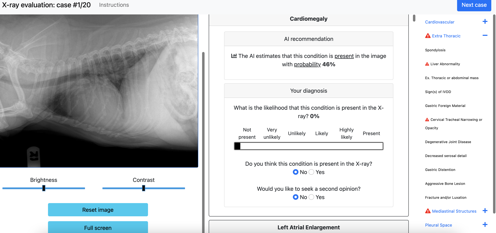

# Overview

This repository contains the Django web app described in the paper [*Who Goes
First? Influences of Human-AI Workflow on Decision Making in Clinical
Imaging*](https://arxiv.org/abs/2205.09696). In the experiment, we designed a
clinical imaging task where veterinary radiologists were asked to inspect and
identify 33 different findings in real X-ray images obtained from historical
data, with the help of an AI tool, using the interface below. Despite retaining
many of the original features, the web app used in the experiment has been
modified to facilitate the implementation of new experimental designs. 

 

## Our study design
The current platform is based on a study design consisting of 10 "stages" or
series of 20 case evaluations each. 

- Stages 1-2 employ a between-subjects design to study the impact of workflow
configurations on decision-making. 
- Stages 3-8 employ a within-subjects design, where participants make decisions
in presence of AI confidence only; AI confidence and saliency maps generated via
[GradCam](https://openaccess.thecvf.com/content_ICCV_2017/papers/Selvaraju_Grad-CAM_Visual_Explanations_ICCV_2017_paper.pdf);
AI confidence and [explanations of
failure](https://ojs.aaai.org/index.php/HCOMP/article/view/13337). 
- In stage 9, participants can activate the AI help when needed. 
- In stage 10, participants choose which types of AI help they prefer to see by
default, and can still activate additional help when needed. 

The results of stages 1-2 are described in the paper. Findings from the
following stages will be described in upcoming work. The deck of slides
presented to the radiologists in one of our introductory sessions is available
at this
[link](https://docs.google.com/presentation/d/1bFovogwZAOGbFmKCk4-EH5TJIovh3FAbaZytEACqEeE/edit?usp=sharing).


### Note

To preserve anonymity of the study participants, information of the years of
experience on the job and country of origin of our study participants have been
removed from the data. The X-rays have been replaced by placeholder images.


## Setup

For a general introduction to Django, see the [Django
documentation](https://docs.djangoproject.com). 

### Installation

Make sure you have `pipenv` installed. 
Then install from Pipfile:
```
pipenv install
```
And activate the shell:
```
pipenv shell
```
Finally run the web app:
```
python manage.py runserver
```
You will be able to see the starting page for the experimental platform at:
```
http://127.0.0.1:8000/myapp/diagnosistask/ 
```
All the data collected by the platform will be stored in the db.sqlite3 file. The initial file in this repository contains some sample user data to illustrate the platform usage. For example, you can try to use the platform with user ids such as '1' or '12'.  

If you are deploying the app on an Ubuntu server, you want to follow this
[excellent
tutorial](https://tonyj.me/blog/deploy-django-project-ubuntu-server/). 


### Importing your own data

The tables present in the current database have been populated using the data in
`utils` based on the models described in `myapp/models.py`. 

Then

* Potentially remove all tables in the current database and the corresponding
  migrations.
* Modify the database tables. Run `python manage.py makemigrations` to create
  the new tables and then `python manage.py migrate` to apply the tables. 
* Populate the tables with your data. For example, for our study we ran the
  commands in [`management`](myapp/management/commands/) which take the data
  stored in [`utils`](utils/data_for_experiment) as inputs. See [this
  file](utils/scripts/managementcommands.txt) for the full list of steps. 
* Populate the app with your images. The images are currently stored in
  [`static`](myapp/static/myapp/images/). Remember to change all the paths to
  the images both in the data in the databaseb, in the HTML templates, and in
  the javascript files. 


## Bibliography

If you use our platform, please cite our paper: 
```
@article{fogliato2022who, 
        title={Who Goes First? Influences of Human-AI Workflow on Decision Making in Clinical Imaging}, 
        author={Fogliato, Riccardo and Chappidi, Shreya and Lungren, Matthew and Fitzke, Michael and Parkinson, Mark and Wilson, Diane and Fisher, Paul and Horvitz, Eric and Inkpen, Kori and Nushi, Besmira},
        journal={arXiv preprint arXiv:2205.09696},
        year={2022}
} 
```


## Contributing

This project welcomes contributions and suggestions.  Most contributions require you to agree to a
Contributor License Agreement (CLA) declaring that you have the right to, and actually do, grant us
the rights to use your contribution. For details, visit https://cla.opensource.microsoft.com.

When you submit a pull request, a CLA bot will automatically determine whether you need to provide
a CLA and decorate the PR appropriately (e.g., status check, comment). Simply follow the instructions
provided by the bot. You will only need to do this once across all repos using our CLA.

This project has adopted the [Microsoft Open Source Code of Conduct](https://opensource.microsoft.com/codeofconduct/).
For more information see the [Code of Conduct FAQ](https://opensource.microsoft.com/codeofconduct/faq/) or
contact [opencode@microsoft.com](mailto:opencode@microsoft.com) with any additional questions or comments.

## Trademarks

This project may contain trademarks or logos for projects, products, or services. Authorized use of Microsoft 
trademarks or logos is subject to and must follow 
[Microsoft's Trademark & Brand Guidelines](https://www.microsoft.com/en-us/legal/intellectualproperty/trademarks/usage/general).
Use of Microsoft trademarks or logos in modified versions of this project must not cause confusion or imply Microsoft sponsorship.
Any use of third-party trademarks or logos are subject to those third-party's policies.
